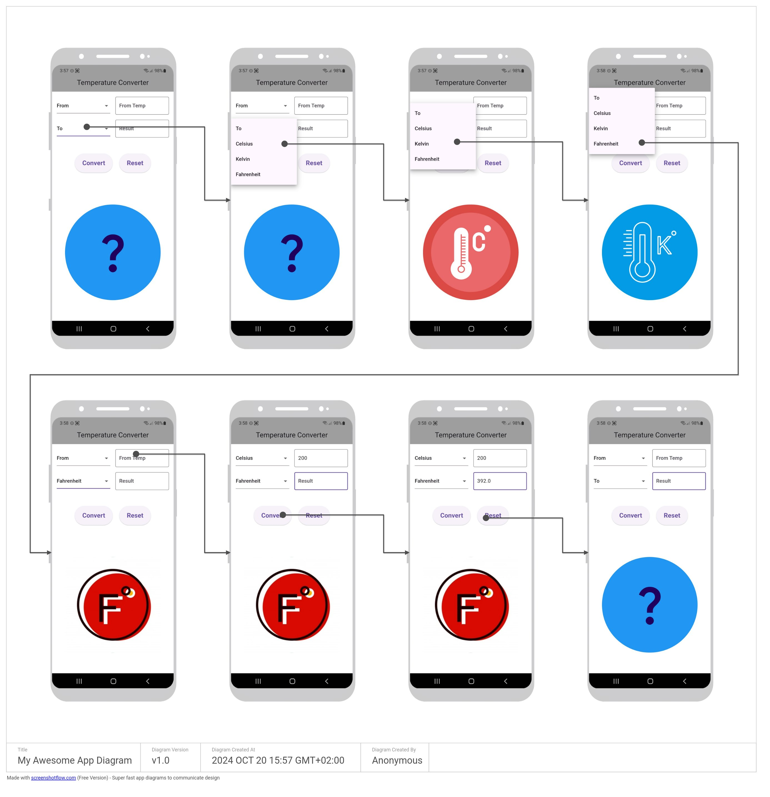

# lab1 : Flutter App for CSE431 

Lab 1 for CSE431 - Mobile Programming's Flutter App

## Functionalities 

- [x] Create a new Flutter App
- [x] Temperature Convertor App
- [x] Convert Celsius to Fahrenheit
- [x] Convert Fahrenheit to Celsius
- [x] Clear Button to clear the input fields
- [x] Error handling for invalid input
- [x] Display the result in a Text Widget

## Screenshots

